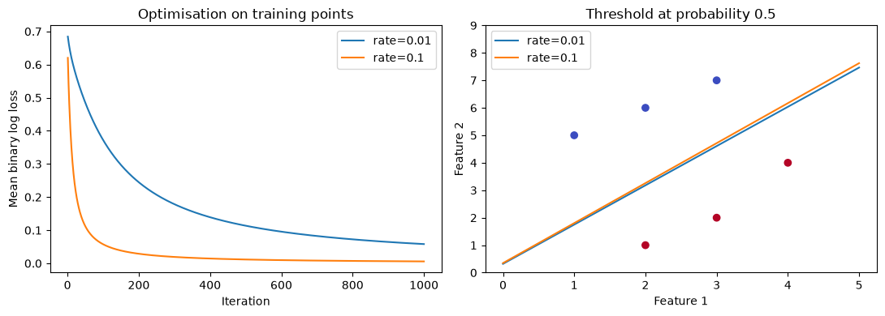

# Machine Learning Fundamentals and Experiments

Educational notebooks exploring linear classification, logistic loss, gradient descent and decision trees. Small NumPy implementations make the learning mechanics visible; scikit-learn experiments illustrate preprocessing, model selection and held-out evaluation.

This is a learning repository, not a production ML system. The numerical helpers and evaluation workflow have focused tests. See [results](reports/RESULTS.md), [changes](docs/CHANGELOG.md) and [attribution](ATTRIBUTION.md).

## Start here

1. [Logistic regression](Logistic_regression_2D.ipynb): loss, gradients, learning rates and stopping criteria.
2. [Decision tree classification](Decision_trees/classification_tree.ipynb): training-only pipelines, pruning and baselines.
3. [Regression trees](Decision_trees/regression_tree.ipynb): model complexity and correctly labelled MAE.



Both curves use the same six synthetic training points; they illustrate optimisation rather than test performance.

## Setup

Use Python 3.12 and run commands from this repository's root. On Windows PowerShell:

```powershell
py -3.12 -m venv .venv
.\.venv\Scripts\python.exe -m pip install -r requirements.txt
.\.venv\Scripts\python.exe -m jupyterlab
```

On macOS or Linux:

```bash
python3.12 -m venv .venv
.venv/bin/python -m pip install -r requirements.txt
.venv/bin/python -m jupyterlab
```

Open a notebook and use Restart Kernel and Run All. The tree notebooks find the project root when started from the root or `Decision_trees` directory. Jupyter launches locally. Dependencies need an initial internet connection; the experiments themselves use bundled or synthetic data.

## Verify

Use the environment's Python executable in place of `python` if it is not activated:

```bash
python -m pytest -q
python scripts/run_notebooks.py
python scripts/evaluate.py
```

The runner executes every notebook in a separate fresh kernel and fails on errors. By default, executed copies go to ignored `build/notebooks`; use `python scripts/run_notebooks.py --write` to refresh committed notebook outputs deliberately. The evaluation command rewrites `reports/metrics.json`; changes should be accompanied by an explanation of the experiment protocol. GitHub Actions runs tests and notebooks on Python 3.12; the first remote run must be checked after upload.

## Notebook index

| Notebook | Question explored |
|---|---|
| [classification](classification.ipynb) | Can random linear boundaries separate two synthetic groups? |
| [classification train test](classification_train_test.ipynb) | How do training and held-out predictions differ? |
| [perceptron](perceptron.ipynb) | How do mistake-driven updates find a separator? |
| [sigmoid 2D](sigmoid_visual_2d.ipynb) | How do weight and bias change a probability curve? |
| [sigmoid 3D](sigmoid_visual_3d.ipynb) | Where is the probability 0.5 boundary on a surface? |
| [cross entropy](CrossEntropyLoss.ipynb) | How do fixed predictions change total binary log loss? |
| [gradient descent](Gradient_Descent_1D.ipynb) | How does a derivative move an iterate down a quadratic? |
| [logistic regression](Logistic_regression_2D.ipynb) | How do learning rate and loss evolve during training? |
| [one hot encoding](one_hot_encoding.ipynb) | How are toy categorical columns represented? |
| [classification tree](Decision_trees/classification_tree.ipynb) | How can pruning be selected without tuning on the test scores? |
| [regression tree](Decision_trees/regression_tree.ipynb) | What happens when a tree fits noise? |

Plotly's 3D notebook is interactive in Jupyter; GitHub's notebook preview may not display it interactively. Other notebooks contain static plots. The cross-entropy visualisation sums loss over four points; the logistic training routine averages loss over examples.

## Implementation map

- `ml_fundamentals/linear.py`: educational NumPy numerical routines.
- `ml_fundamentals/heart.py`: dataset loading and the fixed comparison protocol.
- `tests/`: gradient checks, numerical edge cases, stopping behaviour and pipeline checks.
- `reports/`: recorded results and verification scope.
- `DATA_SOURCES.md`: dataset origin, checksum and attribution.

## Limitations

The Cleveland holdout was already inspected during the original learning exercise, so the revised results are educational and are not independent external validation.
